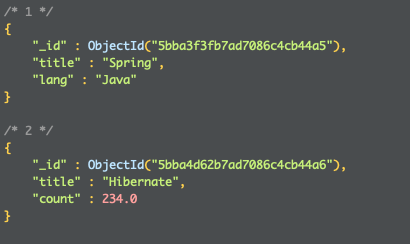

# First Chapter

GitBook allows you to organize your book into chapters, each chapter is stored in a separate file like this one.

```bash
ssh 
```

> mnnm

|  bcvv | nbbn |
| :--- | :--- |
| u7 | 8987 |
| 656 | 8 |


jgffgguf






jjghg



hghg



$$
a = b
$$


