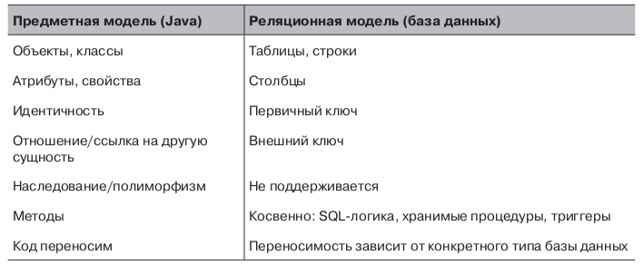

# 1

Интерфейс JPA является стандартом объектно-реляционного отображения для платформ Java SE и Java EE.

Объектно-реляционное отображение выполняет сложную работу. Для каждой структуры в базе данных должна поддерживаться возможность отображения в произвольную предметную модель на Java. Эту проблему отображения часто называют проблемой несоответствия интерфейсов \(impedance mismatch\).

